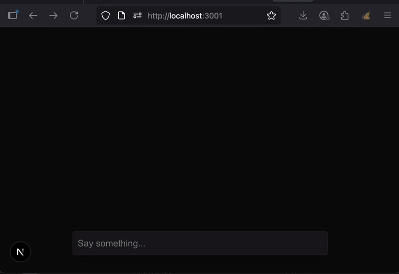
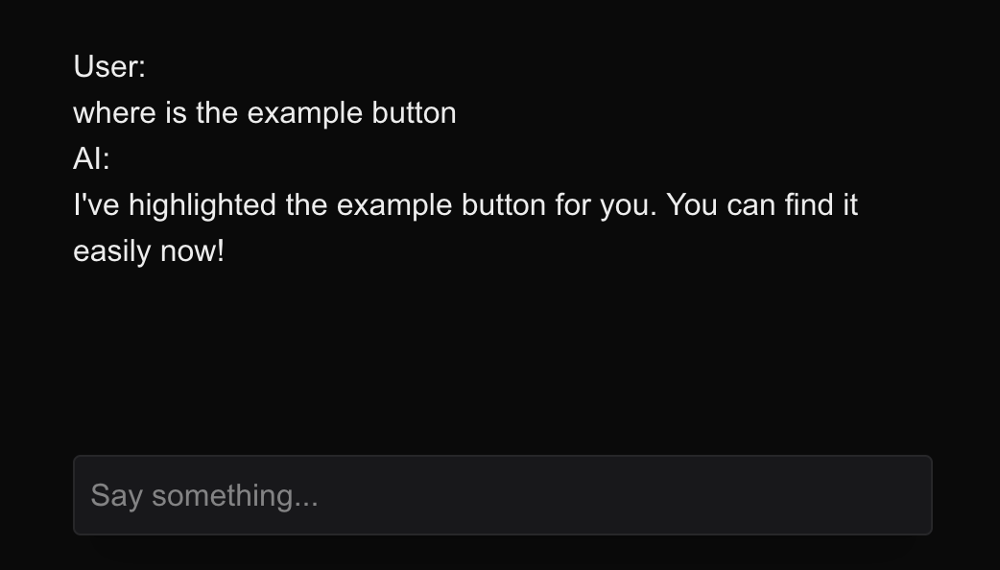
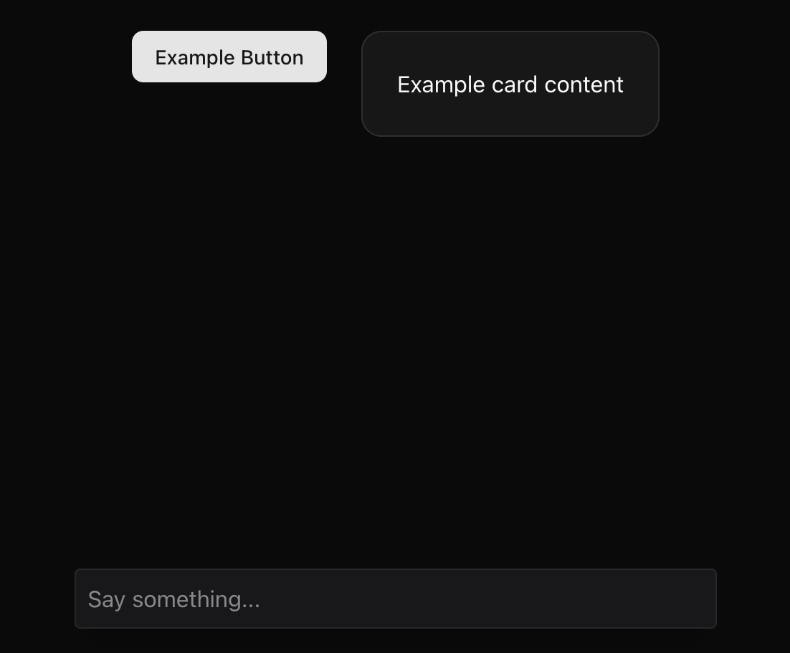
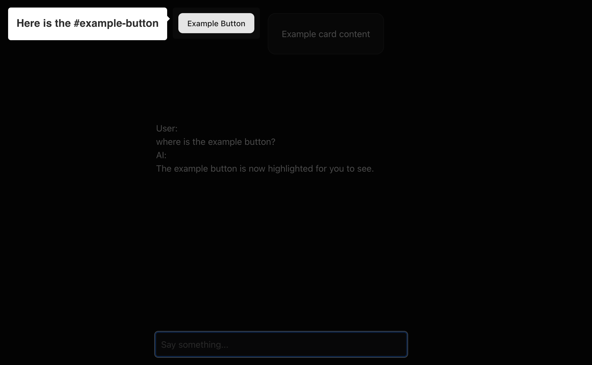

# Conversational AI with DOM Superpowers: A Guide with AI SDK

While AI-first UX continues to evolve, users often still need to interact directly with traditional interfaces. Instead of just providing step-by-step instructions, modern AI assistants should actively help users navigate these interfaces. This guide demonstrates how to build a conversational AI that goes beyond text responses by directly interacting with your web interface through DOM manipulation.

We'll create an AI agent that can highlight specific elements, guide users visually, and perform real UI actions using AI SDK's tool calling capabilities—transforming passive chatbots into interactive interface companions.

## What We're Building

By the end of this guide, you'll have a conversational AI that can:

- Understand user requests about UI elements
- Intelligently decide when visual guidance would be helpful
- Highlight specific DOM elements in real-time
- Provide contextual assistance within your existing interface

## Setting Up the Foundation

Before we add DOM superpowers, we need a solid conversational AI foundation. Next.js paired with AI SDK provides the fastest path to a production-ready chatbot.

### Initial Project Setup

Create a new Next.js application:

```shell
npx create-next-app@latest chat-ai-dom-tool
```

Add your OpenAI API key to a `.env` file:

```
OPENAI_API_KEY=sk-proj-8mHicQQr...
```

Install the required AI SDK dependencies:

```shell
npm i ai @ai-sdk/openai @ai-sdk/react
```

### Building the Chat Infrastructure

Create the chat API route at `/app/api/chat/route.ts`:

```javascript
import { openai } from '@ai-sdk/openai';
import { streamText, UIMessage, convertToModelMessages } from 'ai';

export async function POST(req: Request) {
  const { messages }: { messages: UIMessage[] } = await req.json();

  const result = streamText({
    model: openai('gpt-4o-mini'),
    messages: convertToModelMessages(messages),
  });

  return result.toUIMessageStreamResponse();
}
```

The API route implementation is straightforward, thanks to AI SDK's intuitive function naming. The `streamText` function handles the AI conversation logic, while `toUIMessageStreamResponse` formats the response for real-time streaming.

Together, these functions leverage [Server Sent Events](https://developer.mozilla.org/en-US/docs/Web/API/Server-sent_events/Using_server-sent_events) to stream responses back to the frontend in real-time, the same technology powering your favorite online AI chat interfaces. This creates the familiar typing effect users expect from modern AI assistants.

With our streaming backend ready, let's build the frontend chat component at `/components/Chat.tsx`:

```javascript
'use client';

import { useChat } from '@ai-sdk/react';
import { useState } from 'react';

export default function Chat() {
  const [input, setInput] = useState('');
  const { messages, sendMessage } = useChat();

  return (
    <div className="flex flex-col w-full max-w-md py-24 mx-auto stretch">
      {messages.map((message) => (
        <div key={message.id} className="whitespace-pre-wrap">
          {message.role === 'user' ? 'User: ' : 'AI: '}
          {message.parts.map((part, i) => {
            switch (part.type) {
              case 'text':
                return <div key={`${message.id}-${i}`}>{part.text}</div>;
            }
          })}
        </div>
      ))}
      <form
        onSubmit={(e) => {
          e.preventDefault();
          sendMessage({ text: input });
          setInput('');
        }}
      >
        <input
          className="fixed dark:bg-zinc-900 bottom-0 w-full max-w-md p-2 mb-8 border border-zinc-300 dark:border-zinc-800 rounded shadow-xl"
          value={input}
          placeholder="Say something..."
          onChange={(e) => setInput(e.currentTarget.value)}
        />
      </form>
    </div>
  );
}
```

Now, replace the default home page content in `app/page.tsx` with our simplified version:

```javascript
import Chat from '@/components/Chat';

export default async function Home() {
  return (
    <div>
      <main>
        <Chat />
      </main>
    </div>
  );
}
```

Test your setup by running `npm run dev` and visiting `http://localhost:3000`. You should see a fully functional chatbot interface.



## Implementing DOM Interaction

Now comes the exciting part—giving our AI the ability to interact with the DOM. We'll use AI SDK's tool calling feature to let the AI decide when and how to highlight interface elements.

### Creating the Highlight Tool

Create a tools configuration file at `app/api/chat/tools.ts`:

```javascript
import { InferUITools, tool } from 'ai';
import { z } from 'zod';

export const tools = {
  highlight: tool({
    description:
      'Highlight a DOM element for a user to see. The following elements can be highlighted: #example-button, #example-card',
    inputSchema: z.object({
      element: z.string().describe('The element to highlight'),
    }),
    execute: async ({ element }) => {
      return { element };
    },
  }),
} as const;

// Extract the tool types using the official helper
export type ChatTools = InferUITools<typeof tools>;
```

This tool definition is elegantly simple. The AI will autonomously determine whether highlighting an element would benefit the user's request—a perfect application of LLM reasoning capabilities.

### Enhancing the System Prompt

Update your chat route to include available tools in the system prompt:

```javascript
import { openai } from '@ai-sdk/openai';
import { streamText, UIMessage, convertToModelMessages, stepCountIs } from 'ai';
import { tools } from './tools';

export async function POST(req: Request) {
  const { messages }: { messages: UIMessage[] } = await req.json();

  const result = streamText({
    model: openai('gpt-4o-mini'),
    messages: convertToModelMessages(messages),
    stopWhen: stepCountIs(5), // Enable multi step workflows (required for tools)
    tools, // Add our tools to the LLM!
  });

  return result.toUIMessageStreamResponse();
}
```

At this point, try asking your AI "where is the example button?" You'll notice the AI responds as if it highlighted the element—because it did execute the tool! However, the visual highlighting hasn't happened yet. This demonstrates the AI's understanding of user intent and its decision-making process around when to use tools.



## Bringing the Highlighting to Life

The final step involves connecting the AI's tool execution to actual DOM manipulation. We'll create a system that listens for tool results and performs the corresponding UI actions.

### Adding Interface Elements

First, instead of building UI components we will leverage shadcn, install the UI components we'll be highlighting:

```shell
npx shadcn@latest add button
npx shadcn@latest add card
```

Add these elements to your `app/page.tsx` so the AI has something to highlight:

```javascript
import Chat from '@/components/Chat';
import { Button } from '@/components/ui/button';
import { Card, CardContent } from '@/components/ui/card';

export default async function Home() {
  return (
    <div>
      <main>
        <div className="flex p-6 gap-6 align-center justify-center">
          <Button id="example-button">Example Button</Button>
          <Card id="example-card" title="Example Card">
            <CardContent>Example card content</CardContent>
          </Card>
        </div>
        <Chat />
      </main>
    </div>
  );
}
```

Now we should have some elements to highlight above our chat:



### Setting Up the Highlighting System

Install driver.js, a lightweight library perfect for element highlighting:

```shell
npm install driver.js
```

Create a basic React Context system to manage highlighting functionality:

```javascript
'use client';

import React, {
  createContext,
  useContext,
  useCallback,
  ReactNode,
} from 'react';
import { driver, Driver } from 'driver.js';
import 'driver.js/dist/driver.css';

interface HighlightConfig {
  element: string | HTMLElement;
  popover?: {
    title?: string;
    description?: string;
  };
}

interface HighlightContextType {
  highlight: (config: HighlightConfig) => void;
}

// Context
const HighlightContext = createContext<HighlightContextType | undefined>(
  undefined
);

// Provider
export function HighlightProvider({ children }: { children: ReactNode }) {
  const driverInstanceRef = React.useRef<Driver | null>(null);

  // Get or create driver instance
  const getDriverInstance = useCallback(() => {
    if (!driverInstanceRef.current) {
      driverInstanceRef.current = driver();
    }
    return driverInstanceRef.current;
  }, []);

  // Cleanup on unmount
  React.useEffect(() => {
    return () => {
      if (driverInstanceRef.current) {
        driverInstanceRef.current.destroy();
        driverInstanceRef.current = null;
      }
    };
  }, []);

  const highlight = useCallback(
    (config: HighlightConfig) => {
      const driverInstance = getDriverInstance();
      driverInstance.highlight(config);
    },
    [getDriverInstance]
  );

  const contextValue: HighlightContextType = {
    highlight,
  };

  return (
    <HighlightContext.Provider value={contextValue}>
      {children}
    </HighlightContext.Provider>
  );
}

// Hook to use context
export function useHighlight() {
  const context = useContext(HighlightContext);
  if (context === undefined) {
    throw new Error('useHighlight must be used within a HighlightProvider');
  }
  return context;
}
```

Now add the `HighlightProvider` to our `app/layout.tsx` so our chat component can access the `HighlightContext`:

```javascript
import type { Metadata } from 'next';
import { Geist, Geist_Mono } from 'next/font/google';
import './globals.css';
import { HighlightProvider } from '@/components/HighlightProvider';

const geistSans = Geist({
  variable: '--font-geist-sans',
  subsets: ['latin'],
});

const geistMono = Geist_Mono({
  variable: '--font-geist-mono',
  subsets: ['latin'],
});

export const metadata: Metadata = {
  title: 'Create Next App',
  description: 'Generated by create next app',
};

export default function RootLayout({
  children,
}: Readonly<{
  children: React.ReactNode;
}>) {
  return (
    <html lang="en" className="dark">
      <body
        className={`${geistSans.variable} ${geistMono.variable} antialiased`}
      >
        <HighlightProvider>{children}</HighlightProvider>
      </body>
    </html>
  );
}
```

This context provides a clean interface for triggering highlights throughout your application. More importantly, it demonstrates a key architectural pattern: how AI chat responses can publish tool results that other parts of your application can consume and act upon. This separation of concerns keeps your AI logic decoupled from your UI interactions while enabling powerful integrations.

### Connecting Tool Results to DOM Actions

The crucial final step is listening for tool executions and triggering the corresponding DOM interactions. When the AI uses a tool, it creates message parts with types like `tool-{toolName}` in the response. We can use the `onFinish` callback when the entire response is complete to check if there are any tool results in the message parts. If the highlight tool was used, we trigger our highlighting:

```javascript
'use client';

import { useState } from 'react';
import { ToolUIPart, UIDataTypes, UIMessage } from 'ai';
import { useChat } from '@ai-sdk/react';
import { useHighlight } from '@/components/HighlightProvider';
import { ChatTools } from '@/app/api/chat/tools';

export default function Chat() {
  const [input, setInput] = useState('');
  const { highlight } = useHighlight();
  const { messages, sendMessage } = useChat<
    UIMessage<unknown, UIDataTypes, ChatTools>
  >({
    onFinish: ({ message }) => {
      message.parts
        // Filter for tool parts that have completed execution
        ?.filter(
          (part): part is ToolUIPart<ChatTools> =>
            part.type.startsWith('tool-') &&
            'state' in part &&
            part.state === 'output-available'
        )
        // Execute any highight tool results
        .forEach((toolResult) => {
          if (toolResult.type === 'tool-highlight') {
            const highightResult = toolResult as Extract<
              ToolUIPart<ChatTools>,
              { type: 'tool-highlight' }
            >;
            if (highightResult.output) {
              highlight({
                element: highightResult.output.element,
                popover: {
                  title: `Here is the ${highightResult.output.element}`,
                },
              });
            }
          }
        });
    },
  });

  return (
    <div className="flex flex-col w-full max-w-md py-24 mx-auto stretch">
      {messages.map((message) => (
        <div key={message.id} className="whitespace-pre-wrap">
          {message.role === 'user' ? 'User: ' : 'AI: '}
          {message.parts.map((part, i) => {
            switch (part.type) {
              case 'text':
                return <div key={`${message.id}-${i}`}>{part.text}</div>;
            }
          })}
        </div>
      ))}
      <form
        onSubmit={(e) => {
          e.preventDefault();
          sendMessage({ text: input });
          setInput('');
        }}
      >
        <input
          className="fixed dark:bg-zinc-900 bottom-0 w-full max-w-md p-2 mb-8 border border-zinc-300 dark:border-zinc-800 rounded shadow-xl"
          value={input}
          placeholder="Say something..."
          onChange={(e) => setInput(e.currentTarget.value)}
        />
      </form>
    </div>
  );
}
```

## Testing Your AI Assistant

Return to your application at `http://localhost:3000` and ask "where is the example button?" again. This time, you'll see the button actually highlighted on the page—your AI has successfully connected conversation to interface interaction!



### Testing Different Scenarios

Try experimenting with various prompts to see your AI's intelligence in action:

- **"Where is the card?"** - Watch as the AI highlights the card component
- **"Where is the table?"** - Observe the AI's smart response explaining it cannot locate elements not defined in the tool description

This demonstrates the AI's contextual awareness—it knows exactly which elements it can highlight based on your tool configuration, and gracefully handles requests for elements that don't exist. The AI doesn't just blindly execute tools; it makes intelligent decisions about when and how to help users navigate your interface.

## Beyond Basic Highlighting

While this example focuses on highlighting, the pattern opens up countless possibilities:

**Navigation**: "Show me the analytics dashboard" could highlight the correct menu item and navigate there

**Form Assistance**: "Help me fill out this form" could guide users field by field with contextual highlighting

**Onboarding**: New users could receive personalized, interactive tours based on their questions

## Key Takeaways

This approach demonstrates several important principles:

**AI-Driven Decision Making**: The AI autonomously decides when visual assistance would be helpful, rather than requiring explicit commands

**Seamless Integration**: DOM interactions feel natural within the conversation flow, not like separate features

**Extensible Architecture**: The tool-calling pattern scales to support increasingly sophisticated interface interactions

**User-Centric Design**: Instead of forcing users to learn new interaction patterns, the AI adapts to help with existing interfaces

## Looking Forward

As AI assistants become more sophisticated, the boundary between conversation and interface will continue to blur. Users shouldn't need to choose between getting answers and getting things done—modern AI should excel at both.

The foundation you've built here can evolve into comprehensive interface companions that understand not just what users want to know, but how to help them accomplish their goals within your specific application context.

Traditional UX isn't disappearing anytime soon, but it's becoming more intelligent. By combining conversational AI with direct interface manipulation, we're creating experiences that are both familiar and surprisingly magical.

## Source

The source code for this project can be found at: https://github.com/edodso2/blog/tree/master/chat-ai-dom-tool
