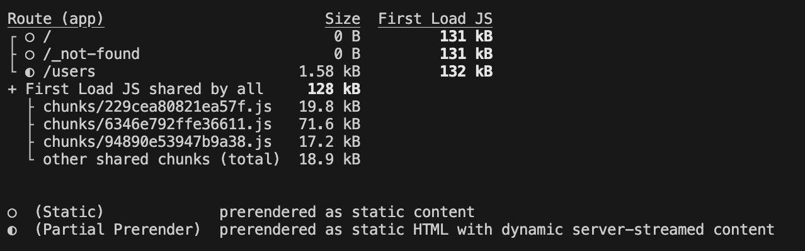

# Build Once Run Anywhere With Next.js New cacheComponents Feature

The latest `cacheComponents` feature in Next.js finally allows us to easily build apps that can build once run anywhere by disabling caching by default and allowing us to opt in if we want certain routes or functions to be cached at build time. 

## Understanding Next.js Default Caching Behavior

This post is part of my Next.js Enterprise Patterns series, where we explore real-world patterns for building scalable, production-ready applications. If you want to follow along with hands-on examples, head over to https://github.com/edodso2/nextjs-spring-boot-enterprise-patterns and clone the repository. Follow the repo README to get both the backend and frontend up and running locally.

The demo application demonstrates a typical enterprise architecture pattern: a Spring Boot backend API serving data to a Next.js frontend.

Once you've started both services and navigated to the Users page, you'll see a simple interface displaying the user data fetched from our Spring Boot API. This simple setup serves as the foundation for exploring Next.js's advanced caching strategies and how they apply in enterprise environments where data freshness, performance, and scalability are critical concerns.

Here's how the Users page looks in action:


Now let's build the frontend app with npm run build to see how Next.js handles our Users page by default. Note that the build output shows us something important about how Next.js has processed our page:


In the build output, you'll see that our Users page has been marked with a static indicator (●), meaning Next.js has prerendered the page at build time. This is Next.js's default caching behavior in action - it detected that our page could be statically generated and cached the rendered HTML.

Prerendering the page will result in stale user data when our app is deployed and started. Let's demonstrate this caching issue with a practical example. We'll add a new user directly to our backend API while the frontend is already built and running:

```bash
curl -X POST \
  -H "Content-Type: application/json" \
  -d '{"firstName":"Andrew","lastName":"Taylor","email":"andrew.taylor@example.com"}' \
  http://localhost:8080/api/users
```

Now run the built frontend app with `npm run start` and navigate to http://localhost:3000/users.

Notice that Andrew Taylor isn't listed! Even though we successfully added him to our backend (you can verify this by calling the API directly), our Next.js frontend is serving the prerendered HTML that was generated at build time - before Andrew existed.

While Next.js's aggressive caching delivers excellent page load performance, it creates a fundamental mismatch between user expectations and application behavior for dynamic data.

**This is exactly why the `cacheComponents` feature exists** - to give us granular control over what gets cached and when, allowing us to optimize for both performance and data freshness where it matters most.

## Enabling cacheComponents

Lets enable the `cacheComponents` feature to get the results we expect. First upgrade to the latest canary build of Next.js

```bash
npm i next@canary
```

Then enable `cacheComponents` in `next.config.js`

```javascript
import type { NextConfig } from 'next';

const nextConfig: NextConfig = {
  experimental: {
    cacheComponents: true,
  },
};

export default nextConfig;
```

Now we need to add a `Suspense` boundary to our `UsersPage` in order successfully build the application with `cacheComponents` enabled. This isn't just a technical requirement - it's Next.js's way of implementing **Partial Prerendering (PPR)**, a powerful optimization strategy. Lets see how it works:

```javascript
import { Suspense } from 'react';
import AddUser from '@/features/users/AddUser';
import UserTable from '@/features/users/UserTable';
import { User } from '@/features/users/types';
import { userService } from '@/services/user-service';

async function DynamicUserList() {
  const users: User[] = await userService.getUsers();

  return <UserTable users={users} />;
}

export default async function UsersPage() {
  return (
    <div className="p-6">
      <h1 className="text-2xl font-bold mb-6 text-gray-900 dark:text-white">
        Users
      </h1>

      <Suspense fallback={<div>Loading users...</div>}>
        <DynamicUserList />
      </Suspense>

      <AddUser />
    </div>
  );
}
```

Now run `npm run build` again and observe the output:



Notice that now our Users page is marked as **(Partial Prerender) prerendered as static HTML with dynamic server-streamed content**. This means that Next.js was able to render the static shell of our page (like the heading and layout) while deferring the dynamic content inside the Suspense boundary to be fetched and streamed at runtime. The page loads near-instantly with the static parts visible, while the user sees a loading state until the dynamic data arrives.

This hybrid approach gives us the best of both worlds: the performance benefits of static rendering for the page shell, combined with fresh data fetching for the parts that need it.

The cacheComponents experimental feature fundamentally changes Next.js's caching philosophy. Instead of the traditional "cache by default" approach, it flips the model to "dynamic by default" with explicit opt-in caching. Here's how it works:

With cacheComponents enabled:
- All data fetching operations are excluded from pre-renders by default
- Data is fetched fresh at runtime unless explicitly cached
- You use the `'use cache'` directive to selectively cache specific functions, components, or entire routes
- Traditional route segment configs like `export const dynamic = 'force-dynamic'` are incompatible and disabled

Adding `'use cache'` strategically:

```javascript
async function CachedUserList() {
  'use cache'; // This function's result will now be cached
  const users = await userService.getUsers();
  return <UserTable users={users} />;
}
```

When you add `'use cache'` to a function called during page rendering, Next.js will cache that function's result in memory on the server. Subsequent requests will use the cached data (with a default 15-minute revalidation period), dramatically improving performance for expensive operations while still allowing other parts of your page to remain dynamic.

This granular control lets you optimize precisely what needs caching versus what should always be fresh, giving you fine-tuned performance control that wasn't possible with the previous all-or-nothing caching model.

## Closing Thoughts

In enterprise environments, "build once, run anywhere" architectures are far more popular than Next.js's traditional build-time optimization methodology. Enterprise applications typically need to:

- Deploy the same build artifact across multiple environments (dev, staging, production)
- Fetch data from different APIs depending on the deployment context
- Handle dynamic content that can't be predetermined at build time
- Scale horizontally without being tied to build-time data assumptions

The `cacheComponents` feature represents Next.js's recognition of these enterprise requirements. By shifting from "cache by default" to "dynamic by default" with explicit opt-in caching.
