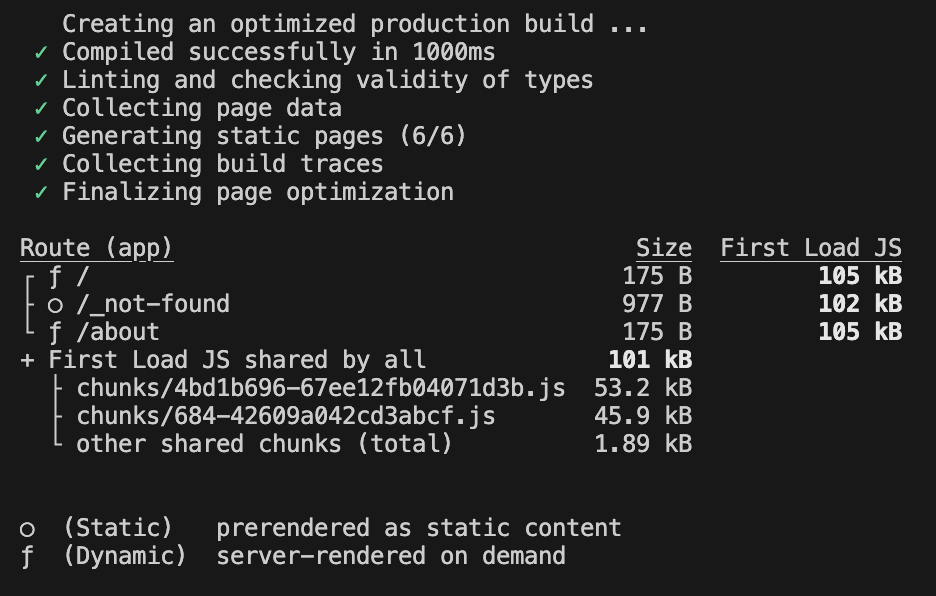

# Enterprise Configuration Management in Next.js: A Caching-First Approach

Enterprise applications often require dynamic configuration fetched from remote servers at runtime. While traditional React applications typically store this configuration in application state, browser storage, or React Context, Next.js offers a more elegant solution through its powerful caching capabilities.

In this post, I'll demonstrate a proof-of-concept approach that leverages Next.js caching to efficiently manage remote configuration, eliminating the need for complex client-side state management while maintaining excellent performance.

## The Challenge

Consider a common enterprise scenario: you need to fetch application configuration at runtime based on a subdomain. Each subdomain might have different feature flags, branding, or business logic that affects how your application behaves.

Traditional approaches might involve:
- Storing configuration in React Context
- Managing cache invalidation manually
- Handling loading states across components
- Coordinating multiple API calls for the same configuration

## The Next.js Solution

Next.js provides sophisticated caching mechanisms that we can leverage to solve this problem elegantly. Let's build a simple demo with two projects: a Next.js application and a backend service that returns configuration data.

### Setting Up Configuration Fetching

First, we'll create a server-only function to fetch configuration based on the current subdomain:

```javascript
import { headers } from 'next/headers';
import 'server-only';

export const getConfig = async () => {
  const headersList = await headers();
  const host = headersList.get('host');

  // Extract subdomain from the host header
  const subdomain = host?.split('.')[0] || 'default';

  // Fetch configuration with caching enabled
  const response = await fetch(
    `http://localhost:3004/config?subdomain=${subdomain}`,
    {
      cache: 'force-cache',
      next: { revalidate: 3600 }, // Cache for 1 hour
    }
  );

  return response.json();
};
```

The key here is the caching configuration:
- `cache: 'force-cache'` tells Next.js to cache the response
- `next: { revalidate: 3600 }` sets a 1-hour cache duration
- Next.js automatically handles cache keys based on request parameters

### Using Configuration Across Components

With caching in place, we can now call `getConfig()` freely throughout our application without worrying about performance. Here's how it looks in practice:

**Home Page (`page.tsx`):**
```javascript
import { getConfig } from '@/lib/config';
import Link from 'next/link';

export default async function Home() {
  const config = await getConfig();

  return (
    <div className="min-h-screen p-8 flex flex-col items-center justify-center gap-8">
      <main className="text-center">
        <h1 className="text-4xl font-bold mb-4">{config.title}</h1>
        <p className="text-lg mb-6">
          {config.pro ? 'PRO Account' : 'Standard Account'}
        </p>
        <Link 
          href="/about" 
          className="bg-blue-500 text-white px-4 py-2 rounded hover:bg-blue-600"
        >
          About
        </Link>
      </main>
    </div>
  );
}
```

**About Page (`about/page.tsx`):**
```javascript
import { getConfig } from '@/lib/config';
import Link from 'next/link';

export default async function About() {
  const config = await getConfig();

  return (
    <div className="min-h-screen p-8 flex flex-col items-center justify-center gap-8">
      <main className="text-center">
        <h1 className="text-4xl font-bold mb-4">About Page</h1>
        <p className="text-lg mb-6">
          Account Type: {config.pro ? 'PRO' : 'Standard'}
        </p>
        <Link 
          href="/" 
          className="bg-blue-500 text-white px-4 py-2 rounded hover:bg-blue-600"
        >
          Home
        </Link>
      </main>
    </div>
  );
}
```

## The Magic of Caching

Here's the remarkable part: despite both pages calling `getConfig()`, the remote API is only called once per subdomain per cache period. As users navigate between pages, subsequent requests are served from Next.js's cache, providing:

- **Zero additional network requests** after the initial fetch
- **Consistent configuration** across all components
- **Simplified code** without complex state management
- **Automatic cache invalidation** after the revalidation period


## Production Considerations

### Dynamic Rendering
When your API uses runtime parameters like subdomains, Next.js intelligently switches affected pages to dynamic rendering, ensuring they're processed at request time rather than being pre-rendered.



### Testing in Production Mode
This caching behavior only works in production mode. For testing:

```bash
npm run build
npm run start
```

### Cache Management
If you make backend changes during development, clear the cache folder:

```bash
rm -rf .next/cache
```

### Client Components
For client components, you have two options:

1. **Pass configuration as props** from a server component
2. **Use Server Actions** to fetch configuration (caching still applies)

```javascript
// Server Action approach
import { getConfig } from '@/lib/config';

export async function getClientConfig() {
  'use server';
  return await getConfig();
}
```

## Benefits of This Approach

This caching-first approach offers several advantages over traditional configuration management:

**Simplicity**: No need for complex state management libraries or patterns
**Performance**: Automatic request deduplication and caching
**Reliability**: Built-in error handling and retry mechanisms
**Scalability**: Efficient handling of multiple configuration requests
**Maintainability**: Clear, declarative code that's easy to understand

## Conclusion

While enterprise patterns often deviate from standard practices, they're crucial to explore within modern frameworks like Next.js. By leveraging Next.js's caching capabilities, we can implement sophisticated configuration management that's both performant and maintainable.

This approach transforms what could be a complex state management problem into a simple, declarative solution that takes full advantage of Next.js's built-in optimizations. The result is cleaner code, better performance, and a more robust application architecture.

---

*Want to see this in action? Check out the [complete demo repository](https://github.com/edodso2/blog/tree/master/nextjs-configuration-management) with both the Next.js application and backend service.*
